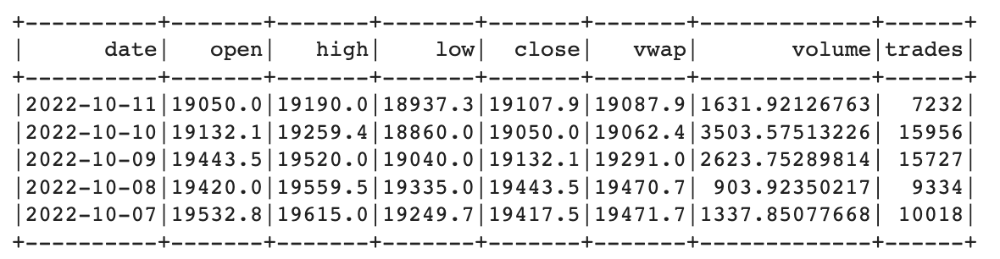
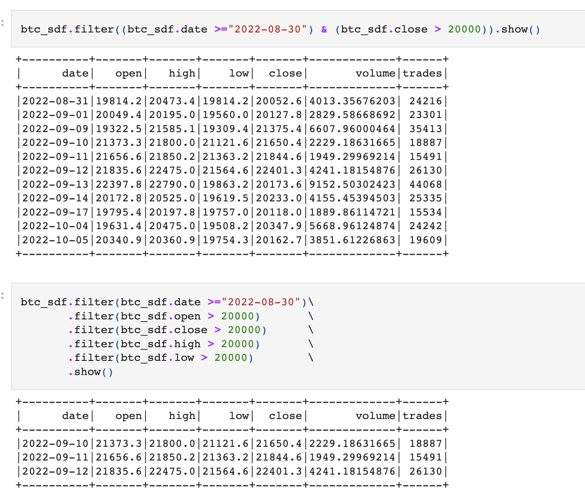
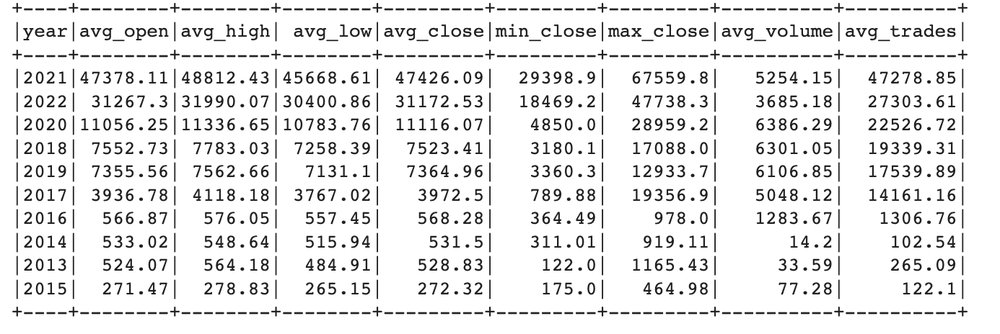

# PySpark_101:
## Overview
* A short summary of PySpark DataFrame 
* Using Bitcoin Dataset created from sending Kraken API requests
* Local cluster manager
* Interactive clients(Jupyter Notebook) execution mode

```
import pyspark
from pyspark.sql.types import *
import pyspark.sql.functions as F
from pyspark.sql import SparkSession

spark = SparkSession.builder.appName("bitcoin_pyspark_kraken_json").getOrCreate()
spark
```
```
resp = requests.get('https://api.kraken.com/0/public/OHLC?pair=XBTUSD&interval=1440&since=unix_now').json()
btc_json = resp['result']['XXBTZUSD']
btc_spark_df = spark.createDataFrame(btc_json)

btc_spark_df = btc_spark_df.withColumnRenamed('_1', "date")\
                           .withColumnRenamed('_2', "open")\
                           .withColumnRenamed('_3', "high")\
                           .withColumnRenamed('_4', "low")\
                           .withColumnRenamed('_5', "close")\
                           .withColumnRenamed('_6', "vwap")\
                           .withColumnRenamed('_7', "volume")\
                           .withColumnRenamed('_8', "trades")
                           
btc_spark_df = btc_spark_df.withColumn("date", F.from_unixtime(F.col("date"), 'yyyy-MM-dd').cast("date"))
btc_spark_df.orderBy(btc_spark_df.date.desc()).show(5)
 ```
 
 
 ```
sql_df.createOrReplaceTempView("btc_sql2")
spark.sql("""
SELECT year, 
       ROUND(AVG(open), 2) as avg_open,
       ROUND(AVG(high), 2) as avg_high,
       ROUND(AVG(low),  2) as avg_low,
       ROUND(AVG(close),2) as avg_close,
       ROUND(MIN(close),2) as min_close,
       ROUND(MAX(close),2) as max_close,
       ROUND(AVG(volume),2)as avg_volume,
       ROUND(AVG(trades),2)as avg_trades
FROM btc_sql2
GROUP BY year
ORDER BY AVG(close) DESC
""").show()
 ```
 

